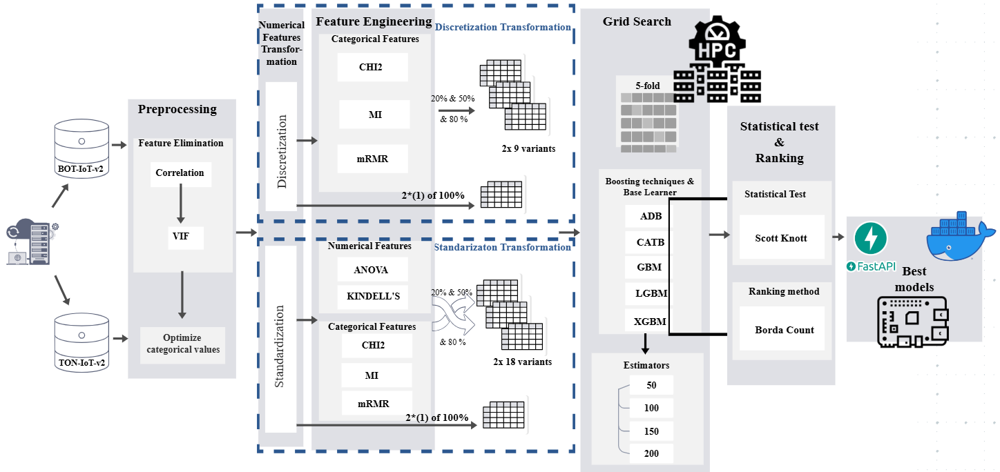

# New Design Strategies for IoT Intrusion Detection using Boosting and Feature Selection

## Authors
Abderahmane. HAMDOUCHI (Vanguard Center, Mohammed VI Polytechnic University, UM6P, Morocco)
Ali IDRI (Data and Software Sciences Research Laboratory, ENSIAS, Mohammed V University in Rabat, Morocco)

Contact: abderahmane.hamdouchi@um6p.ma ; ali.idri@um5.ac.ma

---

## Abstract
This repository contains the code and notebooks for the research paper "New Design Strategies for IoT Intrusion Detection using Boosting and Feature Selection." The study addresses the security challenges in IoT environments by evaluating advanced ensemble learning methods, focusing on boosting algorithms and feature selection strategies. The experiments leverage two large NetFlow-based IoT datasets and utilize high-performance computing resources to ensure scalability and robustness.

## Research Highlights
- **Comprehensive Evaluation:** 1160 boosting models were systematically evaluated using five boosting algorithms (ADB, GBM, CATB, LGBM, XGB) and four estimator settings (50, 100, 150, 200).
- **Feature Engineering:** Both categorical and numerical features were optimized using discretization and standardization, with filter-based feature selection (ANOVA, Kendall’s tau, MI, mRMR, Chi2).
- **High-Performance Computing:** All experiments were conducted on the TOUBKAL Supercomputer, utilizing parallel and distributed processing for large-scale data.
- **Robust Evaluation Metrics:** Models were assessed using MCC, Cohen's kappa, F1-score, and accuracy, and ranked with the Scott-Knott test and Borda count.
- **Deployment:** The best models were containerized and tested on resource-constrained devices (Raspberry Pi) to validate real-world applicability.

## Methodology Overview

### Experimental Design Process
The following figure illustrates the experimental design process described in the methodology:

1. **Data Preprocessing:**
   - Removal of missing values, duplicates, and irrelevant features.
   - Categorical features were grouped and optimized (e.g., IP addresses, ports, protocols).
   - Numerical features were transformed using discretization (quantile-based binning) and standardization (zero mean, unit variance).
   - Redundant features were removed based on correlation and VIF analysis.
2. **Feature Selection:**
   - Applied filter-based methods with three thresholds (20%, 50%, 80%).
   - Categorical and numerical features were processed with appropriate FS techniques.
   - Generated 29 dataset variants per dataset (discretized and standardized).
3. **Model Training and Evaluation:**
   - Trained 1160 models (5 algorithms × 4 estimators × 58 dataset variants).
   - Used five-fold cross-validation and multiple metrics for robust assessment.
   - Top models identified using statistical ranking (Scott-Knott and Borda count).
4. **Model Comparison and Deployment:**
   - Compared FS methods and transformation strategies.
   - Exported top models as pickle files and deployed using FastAPI and Docker on Raspberry Pi.

## Key Results (Table 6 Summary)

The Scott-Knott (SK) test was used to select the best number of estimators for each boosting algorithm and evaluation variant. These repositories include SK plots for each evaluation variant and are named as follows:

- Plot SK Estimator NF-ToN-IoT-v2 Discretization
- Plot SK Estimator NF-ToN-IoT-v2 Standardization
- Plot SK Estimator NF-BoT-IoT-v2 Discretization
- Plot SK Estimator NF-BoT-IoT-v2 Standardization
| Dataset         | Transformation   | % Features | # Features | Best Combination         | MCC  | Kappa | F1   | Accuracy | Model Size (KB) | Prediction Time (μs) |
|-----------------|-----------------|------------|------------|-------------------------|------|-------|------|----------|-----------------|----------------------|
| NF-ToN-IoT-v2   | Discretization  | 20%        | 7          | Chi2+XGB_200            | 0.89 | 0.89  | 0.96 | 95%      | 719             | 3937.91              |
|                 |                 | 50%        | 18         | Chi2+XGB_200            | 0.95 | 0.95  | 0.98 | 98%      | 734             | 4284.50              |
|                 |                 | 80%        | 25         | mRMR+XGB_200            | 0.96 | 0.96  | 0.99 | 98%      | 721             | 5067.85              |
|                 |                 | 100%       | 35         | XGB_200                 | 0.97 | 0.97  | 0.99 | 99%      | 726             | 5395.13              |
|                 | Standardization | 20%        | 7          | K+MI+XGB_200            | 0.95 | 0.95  | 0.98 | 98%      | 831             | 4334.21              |
|                 |                 | 50%        | 18         | A+mRMR+XGB_200          | 0.98 | 0.98  | 0.99 | 99%      | 796             | 4316.57              |
|                 |                 | 80%        | 25         | K+mRMR+XGB_200          | 0.98 | 0.98  | 0.99 | 99%      | 798             | 4174.59              |
|                 |                 | 100%       | 35         | XGB_200                 | 0.98 | 0.98  | 0.99 | 99%      | 800             | 5393.22              |
| NF-BoT-IoT-v2   | Discretization  | 20%        | 7          | Chi2+XGB_200 & CATB_150 | 0.77 | 0.76  | 1.00 | 100%     | 400 & 163        | 3764.03 & 2472.31     |
|                 |                 | 50%        | 18         | mRMR+XGB_200            | 0.89 | 0.89  | 1.00 | 100%     | 544             | 4226.32              |
|                 |                 | 80%        | 25         | mRMR+XGB_150            | 0.97 | 0.97  | 1.00 | 100%     | 353             | 3894.97              |
|                 |                 | 100%       | 35         | XGB_200                 | 0.97 | 0.97  | 1.00 | 100%     | 454             | 4570.41              |
|                 | Standardization | 20%        | 7          | A+Chi2+XGB_200          | 0.97 | 0.97  | 1.00 | 100%     | 435             | 3735.73              |
|                 |                 | 50%        | 18         | A+Chi2+XGB_200          | 0.99 | 0.99  | 1.00 | 100%     | 441             | 4385.69              |
|                 |                 | 80%        | 25         | K+mRMR+XGB_200          | 0.99 | 0.99  | 1.00 | 100%     | 427             | 4714.78              |
|                 |                 | 100%       | 35         | XGB_200                 | 0.99 | 0.99  | 1.00 | 100%     | 422             | 4832.86              |

## Repository Structure
- `Standarization NF-ToN-IoT-v2.ipynb`: Jupyter notebook for feature engineering, selection, and model training on the NF-ToN-IoT-v2 dataset using standardization.
- `Standarization NF-BoT-IoT-v2.ipynb`: Notebook for the NF-BoT-IoT-v2 dataset with standardization.
- `Descritization NF-ToN-IoT-v2.ipynb`: Notebook for discretization-based experiments on NF-ToN-IoT-v2.
- `Descritization NF-BoT-IoT-v2.ipynb`: Notebook for discretization-based experiments on NF-BoT-IoT-v2.

## Notebook Content Description
The main notebook, `Standarization NF-ToN-IoT-v2.ipynb`, is organized as follows:
1. **Data Loading and Preprocessing:**
   - Loads the NF-ToN-IoT-v2 dataset and removes irrelevant or redundant features.
   - Optimizes categorical features (e.g., ports, IP addresses, protocols) and transforms numerical features using standardization.
2. **Feature Selection:**
   - Applies ANOVA, Kendall’s tau, mutual information, mRMR, and Chi2 methods to select the most relevant features.
   - Generates multiple feature subsets for model evaluation.
3. **Model Training:**
   - Trains and evaluates boosting models (ADB, GBM, CATB, LGBM, XGB) with different feature subsets and estimator settings.
   - Uses cross-validation and multiple metrics for robust assessment.
4. **Model Export and Deployment:**
   - Saves the best-performing models for deployment.
   - Provides code for containerization and deployment on edge devices.

## How to Use
1. Open the relevant notebook in Jupyter or VS Code.
2. Follow the cells sequentially to preprocess data, select features, train models, and export results.
3. Modify parameters or feature selection thresholds as needed for further experimentation.

## Requirements
- Python 3.8+
- pandas, numpy, scikit-learn, xgboost, lightgbm, catboost, matplotlib, joblib, mrmr, modin, ray, dask
- Jupyter Notebook or VS Code

## Citation
If you use this code or data in your research, please cite the original paper:

> HAMDOUCHI, A., & IDRI, A. (2025). New Design Strategies for IoT Intrusion Detection using Boosting and Feature Selection.

---

For questions or contributions, please contact the authors at the emails above.
